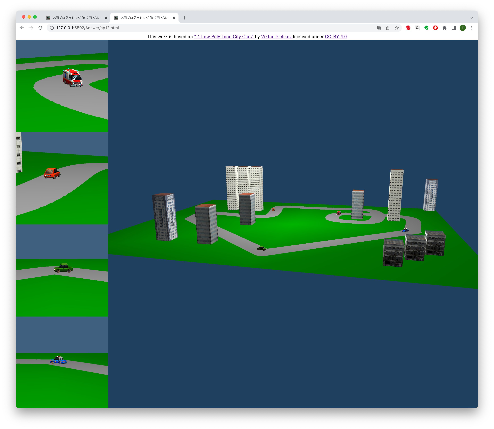

# 共同作業による車が街を走るシーンの作成

応用プログラミングレポート @G184002021 拓殖 太郎

## 作品の概要

下の図のような4台の車が街の中を走るシーンを作った．
画面の右側に全体のシーンが表示され，左側にそれぞれの車の周辺を切り取ったシーンが表示される．
4人のメンバーの共同作業で作られていて，街の平面を4分割した領域を，それぞれのメンバーが担当している．

4台の車は街に設定されたコースの上を周回する．コースを逆向きに回る車も作り，ときどきすれ違うようにした．
街には高さや外見の違う建物がいくつか表示される．

なお，4台の車の3Dモデルは Viktor Tcelikov が SketchFab で公開している[モデル](https://sketchfab.com/3d-models/4-low-poly-toon-city-cars-cdce7c9c2a17473cadd03ce4746b4f13)を利用した．



## 代表的な変数の説明

* `cars` ： 4つの車がまとめられている3Dモデルのシーンから，1台ずつ取り出した車の3Dオブジェクトを，要素数4の配列にまとめたもの，
モデルは gltf 型式だったので，読み込みには `GLTFLoarder` を使用した．モデルには車のパーツなどのいろいろな3Dオブジェクトが含まれているので，
車全体をまとめたオブジェクトは，名前が`SHTV_Prefab_Car_`で初まっていることで区別した．

* `parts` ： 4人のメンバーが修正する JavaScript のファイルで記述された機能のモジュールを配列にまとめたもの，配列の要素ごとに，
そのモジュール内の関数などを呼び出すことで，分担した記述をメインのコードから利用できるようにしている．このため，各自の関数の定義には
`export` を付けて，外部からの参照を許可するようにしている．

* `course`： 3次元座標で指定された複数の制御点をスプライト補間で滑らかに繋いだ曲線．灰色のコースを描画するときは，自分の担当部分の制御点だけを用いて，
分担してコースを描画するようにし，車が周回するコースとして使うときには，全員の制御点を繋いて1つの閉曲線とする．各担当の制御点を繋ぐときに自分の部分から始めることで，同じコースでも開始点が異なり，担当する車が異なった位置で動くようにした．

## 工夫(苦心)したところ

* HTMLファイルにメイン画面，各車の画面の領域を `<div>`要素で設定し(ap12.htmlの23〜34行目)，
CSSスタイルで左右分割の比率やフローレイアウトで縦に並べる設定をした(ap12.htmlの7〜12行目)．

```html
<style>
	body {margin: 0;}
	.header {clear: both; text-align: center}
	.left {float: left; width: 20%}
	.right {float: right; width: 80%}
</style>
```

* メンバーがそれぞれの部分を同時に編集できるように JavaScript の ファイルを 4つ用意し，メインのコードから，それぞれのコードを呼び出して，担当部分のコースの描画や，担当する車の自動運転を実現した．この時それぞれのコードをモジュールとしてまとめて，別々の名前(L1,L2,L3,L4)を付けることで，それぞれのファイルの中で同じ名前で定義された関数を，別々に呼び出すことができるようにした．(ap12.js の 70〜81行目)

```javascript
      // 分担部分の初期化
      parts.forEach((part) => {
        part.module.init(scene, sizeL, part.id, part.offset, texture);
      });
      // 分担部分の自動運転コースの作成
      parts.forEach((part) => {
        part.module.makeCourse(scene);
      });
      // 分担部分の描画
      parts.forEach((part, i) => {
        part.module.setCar(scene, cars[i]);
      });
```

* コースが一定の幅を持った曲線で描画されるように，コースの曲線にから100個の点を取り出し，少しずつずらしながら`circleGeometry` を利用した灰色の円を描くようにした．(ap12L1.js などの 64〜79行目)

```javascript
// 曲線から100箇所を取り出し，円を並べる
    const points = course.getPoints(100);
    points.forEach((point)=>{
        const road = new THREE.Mesh(
            new THREE.CircleGeometry(5,16),
            new THREE.MeshLambertMaterial({
                color: "gray",
            })
        )
        road.rotateX(-Math.PI/2);
        road.position.set(
            point.x,
            0,
            point.z
        );
        scene.add(road);
    });
```

* 担当する車が自分の担当部分だけでなく，他のメンバーが設定したコースの上も動くように，各自が作成したコースの制御点を1つの配列にまとめてから，スプライン補完で滑かにつなぎ，1つの閉曲線になるようにした．(ap12L1.js などの 64〜79行目)

```javascript
// コース(自動運転用)
export function makeCourse(scene) {
    const courseVectors = [];
    const parts = [L1, L2, L3, L4];
    parts.forEach((part) => {
        part.controlPoints.forEach((p) => {
            courseVectors.push(
                new THREE.Vector3(
                    p[0] + part.origin.x,
                    0,
                    p[1] + part.origin.z,
                )
            )
        });
    })
    course = new THREE.CatmullRomCurve3(
        courseVectors, true
    )
}
```

* 車がすれ違うときにモデルが重ならないように，車の描画の原点をモデルの中心ではなく車の外部右側に移動した．このとき，元のモデルの救急車の右側の前後輪だけが，逆向きに回転された状態になっていて，他の車輪とは反対側に移動することがわかったので，モデルのパーツについている名前で区別して，該当する車輪の場合は逆向きに移動するようにした．(ap12.js の 55〜64行目)

```javascript
// 車の部品の中心をずらす (救急車の車輪だけ特別扱い)
          if (obj.name.indexOf("Wheel_Ambulance_FR") == 11
            || obj.name.indexOf("Wheel_Ambulance_BR") == 11
          ) {
            obj.geometry.translate(-200, 0, 0)
          }
          else {
            obj.geometry.translate(200, 0, 0)
          }
```

## 感想

GitHub Classroom のグループ課題を扱うのは初めてだったので，別々の人が独立にリポジトリを更新したときに競合せずに1つの状態にまとまるのか不安だったが，修正するファイルを分けたことで，ほとんど問題が起こらず安心した．

別々のモジュールに分けて importする方法を思い付くのに時間がかかって，いろいろな方法で試行錯誤したが，勉強になった．

結果としては，やりたかったことが実現できたので満足している．